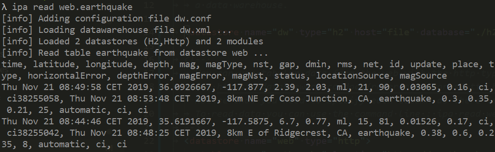

.. _tuto_external_data:

Accessing external data
------------------------

The first step is to defined which data you want to integrate 
in your data warehouse. For this tutorial, we will integrate 
only a web source containing the list of earthquakes over the 
last 7 days (you can find the USGS source website 
`here <https://earthquake.usgs.gov/earthquakes/>`_).
Being a CSV file, we need to provide columns metadata.

Create the file dw.xml and add the following text in it.

.. code-block:: xml

    <datawarehouse>
        <datastore name="web" type="http">
            <table name="earthquake" location="https://earthquake.usgs.gov/earthquakes/feed/v1.0/summary/all_week.csv" 
                format="csv" csvHeader="true">
                <column name="time" type="datetime" temporalFormat="yyyy-MM-dd'T'HH:mm:ss.SSS'Z'"/>
                <column name="latitude" type="numeric"/>
                <column name="longitude" type="numeric"/>
                <column name="depth" type="numeric"/>
                <column name="mag" type="numeric"/>
                <column name="magType" type="text"/>
                <column name="nst" type="numeric"/>
                <column name="gap" type="numeric"/>
                <column name="dmin" type="numeric"/>
                <column name="rms" type="numeric"/>
                <column name="net" type="text"/>
                <column name="id" type="text"/>
                <column name="update" type="datetime" temporalFormat="yyyy-MM-dd'T'HH:mm:ss.SSS'Z'"/>
                <column name="place" type="text"/>
                <column name="type" type="text"/>
                <column name="horizontalError" type="numeric"/>
                <column name="depthError" type="numeric"/>
                <column name="magError" type="numeric"/>
                <column name="magNst" type="numeric"/>
                <column name="status" type="text"/>
                <column name="locationSource" type="text"/>
                <column name="magSource" type="text"/>
            </table>
        </datastore>
    </datawarehouse>

The *dataWarehouse* element is always the root elements as we describe how our 
data warehouse work. Inside, we add an element *datastore* with name 
:strong:`web`, which describe how to retrieve the earthquake list. the 
*type* of this data store is *http* because it is the protocol to get 
website data (the *http* type work as well for *https* websites).

Inside this data store *web* (which would be all the Internet websites), 
we describe a *table* called :strong:`earthquake`. It is defined as a 
comma separated file (*format="csv"*) and the first row should not 
be used as it's an header (*csvHeader="true"*).

Inside this table element, there is a list of columns, 
representing the 22 columns of the source file. Each column is given 
a *name* (which could be different than the one in the file) and a 
*type*. As you can guess, *numeric* is for numerical columns, 
*text* for those with text and *datetime* for those containing a 
date and a time. For the last type, we need to provied a 
*temporalFormat* pattern attribute as the CSV format store date as 
text without any predefined format (hence we should provide it).

We can then access the distant data with baton with the *read* command
which print the first 10 lines : 

.. code-block:: bash

    ipa read web.earthquake

Now that we can access data source, we need to :ref:`replicate it in a data warehouse <tuto_replicate>`.
