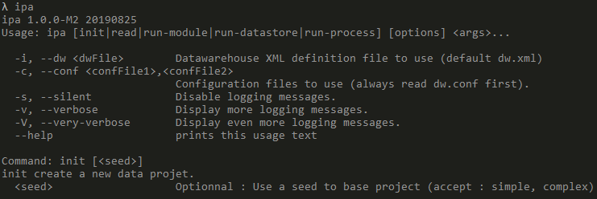

.. _data_tool:

Installation
=================

`Data Brewery <https://databrewery.co>`_ is a free data tool 
to build and manage a very efficient data warehouse. It is based on our 
`Data Warehouse Manifesto <https://dataintoresults.com/post/data-warehouse-manifesto/>`_. 
You can download it 
`here <https://databrewery.co/build/ipa-1.0.0-M2.zip>`_ and unpack it. 
All you need is Java 8 or above.
Then, You can add the bin repertory to your PATH environment variable (you can check 
`here for Windows 10 <https://www.architectryan.com/2018/03/17/add-to-the-path-on-windows-10/>`_).

In order to test your Data Brewery installation, you can call *ipa* 
(for Interactive Processing for Analytics or was it Indian pale Ale?).
You should get the following output :

Congrats, you have installed Data Brewery !

:ref:`Let's now see how project are structured. <structure>`

