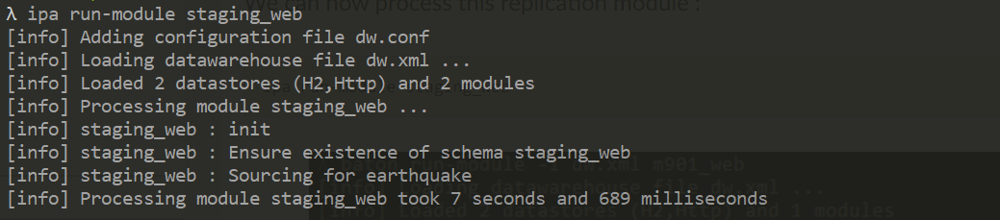
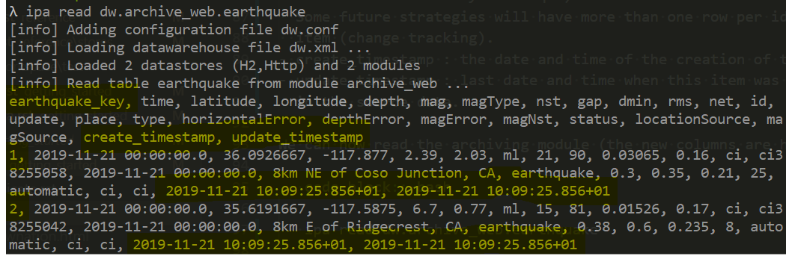

.. _tuto_replicate:

Replicate
-----------------

In order to replicate a data source, we need first provide a data warehouse, where the data will be stored and the refinement will be done. We will use an `H2 database <http://www.h2database.com>`_ so you don't have to install anything. You just have to define the datastore :strong:`dw` as follows :

.. code-block:: xml

   <datastore name="dw" type="h2" host="file" database="./h2dw"/>

H2 will create one or more files starting with *h2dw* in your current directory, you can safely delete them afterward. As you can expect *database* is the database location. It should be noted that a file-based H2 is not a good database engine for a real complex database but it is more convenient for this tutorial.

After defining the data warehouse, we will add a replication module in it. The only focus of this module is to replicate the :strong:`web` datastore. It is simply done by adding the following module element inside the *dataWarehouse*.

.. code-block:: xml

   <module name="staging_web" datastore="dw"> 
      <replicate datastore="web"/>
   </module>

This module is named as the data store, but prefixed by *staging*
which is a convention for replication (staging) modules. 

Another way of doing it is to declare explicitely a table 
and the source to fill it as shown below:

.. code-block:: xml

   <module name="staging_web" datastore="dw"> 
      <table name="earthquake">
         <source type="datastore" datastore="web" table="earthquake"/>
      </table>
   </module>

We can now process this replication module : 

.. code-block:: bash

   ipa run-module staging_web

Being only a replicate of the data source, the module *staging_web* 
only store 7 days of earthquake (provided by teh data source. 
In a data warehouse, you want to 
keep track of every earthquake. To do that, we will add an 
archiving module. By convention, archiving module are prefixed by *archive_*.

.. code-block:: xml

   <module name="archive_web" datastore="dw"> 
      <table name="earthquake" strategy="overwrite" businessKeys="id">
         <source type="module" module="staging_web" table="earthquake"/>
      </table>
   </module>

Notice that *source* elements is of *type* *module*, 
sourcing the data from table :strong:`earthquake` in 
module :strong:`staging_web`. The magic part is the 
*strategy="overwrite"* which instruct to only add new 
data to the table. The default *strategy* is *rebuild*, 
meaning that the table is deleted and rebuilded every 
times. When we use the *overwrite* strategy we need to 
provide a *businessKeys* attribute with the set of columns 
that identifies each row. Here, each earthquake is identified 
by it's *id* column.

It can be processed like any module with the *run-module* command 

.. code-block:: bash

    ipa run-module archive_web

Using the overwrite strategy will also add some new columns : 

- *table*\ _key : a number identifiying the row. With the overwrite 
  strategy there is exactly one key per business key (provided
  that the business key is unique). 
  Some future strategies will have more than one row per identification 
  item (change tracking).
- create_timestamp : the date and time of the creation of this item.
- update_timestamp : last date and time when this item was seen 
  in the source data.

We can now read the archiving module (the new columns are highlighted in yellow) :

.. code-block:: bash

   ipa read dw.archive_web.earthquake

At the end of this step, the `dw.xml` file looks like below. 
It is now time to refine this raw data to produce insight :
:ref:`the refine process <tuto_refine>`.

.. code-block:: xml

    <dataWarehouse>
       <datastore name="dw" type="h2" database="./h2dw">
       </datastore>

        <datastore name="web" type="http">
            <table name="earthquake" location="https://earthquake.usgs.gov/earthquakes/feed/v1.0/summary/all_week.csv" format="csv" csvHeader="true">
                <column name="time" type="datetime" temporalFormat="yyyy-MM-dd'T'HH:mm:ss.SSS'Z'"/>
                <column name="latitude" type="numeric"/>
                <column name="longitude" type="numeric"/>
                <column name="depth" type="numeric"/>
                <column name="mag" type="numeric"/>
                <column name="magType" type="text"/>
                <column name="nst" type="numeric"/>
                <column name="gap" type="numeric"/>
                <column name="dmin" type="numeric"/>
                <column name="rms" type="numeric"/>
                <column name="net" type="text"/>
                <column name="id" type="text"/>
                <column name="update" type="datetime" temporalFormat="yyyy-MM-dd'T'HH:mm:ss.SSS'Z'"/>
                <column name="place" type="text"/>
                <column name="type" type="text"/>
                <column name="horizontalError" type="numeric"/>
                <column name="depthError" type="numeric"/>
                <column name="magError" type="numeric"/>
                <column name="magNst" type="numeric"/>
                <column name="status" type="text"/>
                <column name="locationSource" type="text"/>
                <column name="magSource" type="text"/>
            </table>
        </datastore>

       <module name="staging_web" datastore="dw"> 
          <table name="earthquake">
             <source type="datastore" datastore="web" table="earthquake"/>
          </table>
       </module>

       <module name="archive_web" datastore="dw"> 
          <table name="earthquake" strategy="overwrite" businessKeys="id">
             <source type="module" module="staging_web" table="earthquake"/>
          </table>
       </module>
    </dataWarehouse>

