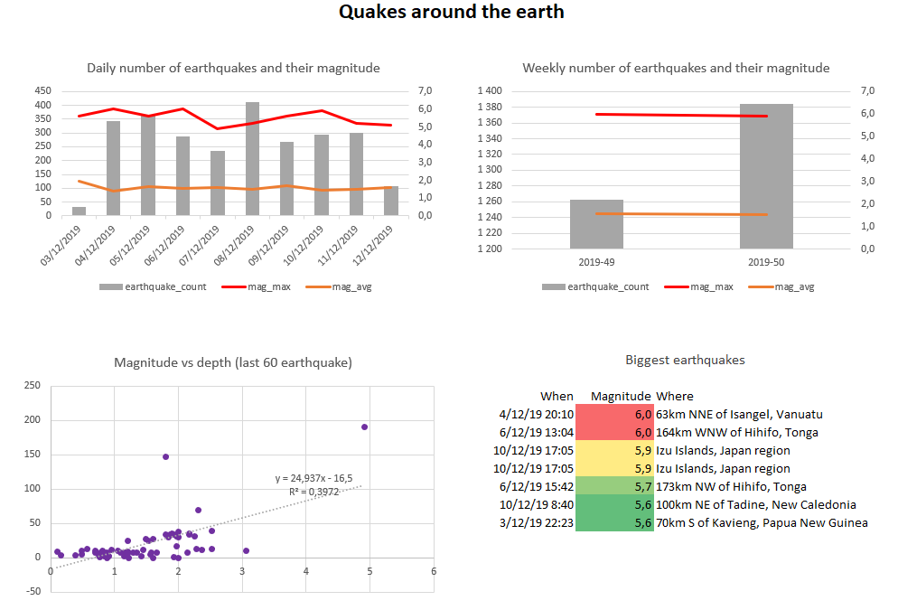
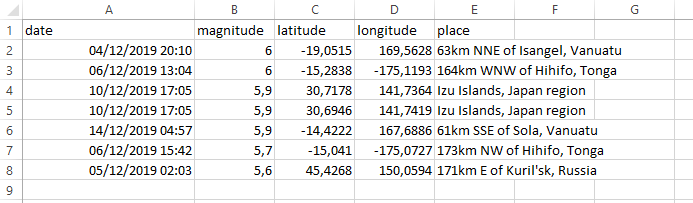

.. _tuto_report:

Create a dashboard
------------------

Finally, we now have all the data to produce an insightful report on earthquakes.

For the sake of simplicity, we will stick with Excel as the reporting tool. Fear not, 
nothing will be manual. Data Brewery will export the data directly in the Excel file
and graph will be updated automatically. and you will get the following result :

You can find some advice on how to use and organize Excel for reporting in my blog post 
`Supercharged Excel for startup analytics with PowerBI <https://dataintoresults.com/post/supercharged-excel-for-startup-analytics-powerbi/>`_.

In the :ref:`external data <tuto_external_data>` part of this tutorial we saw that datastores
can be used for data input. They can also be used for data output.

.. code-block:: xml

  <!-- Output the earthquakes to an Excel report (./report/earthquake.xlsx) -->
  <datastore name="output" type="file" location="./report/">
    <table name="daily_stats" type="xlsx" location="earthquake.xlsx"
      sheet="DATA - Daily stats" colStart="A" rowStart="2">
      <source type="datastoreQuery" datastore="dw">
        select * from "earthquake"."daily_stats" order by "date" asc
      </source>
    </table>
    <table name="weekly_stats" type="xlsx" location="earthquake.xlsx"
      sheet="DATA - Weekly stats" colStart="A" rowStart="2">
      <source type="datastoreQuery" datastore="dw">
        select * from "earthquake"."weekly_stats" order by "date" asc
      </source>
    </table>
    <table name="last_big_ones" type="xlsx" location="earthquake.xlsx"
      sheet="DATA - Greatest earthquakes" colStart="A" rowStart="2">
      <source type="datastoreQuery" datastore="dw">
        select * from "earthquake"."last_big_ones" order by "mag" desc
      </source>
    </table>
    <table name="mag_vs_depth_corr" type="xlsx" location="earthquake.xlsx"
      sheet="DATA - mag vs depth" colStart="A" rowStart="2">
      <source type="module" module="earthquake" table="mag_vs_depth_corr"/>
    </table>
  </datastore>

In order to process the datastore *output*, we need to process it using the command :

.. code-block:: bash

  ipa run-datastore output

Notice that it will fail if the Excel file is open (Microsoft Office having a strong 
sense of ownership). After processing the DATA sheets are updated as you can see below :

Congrats, you have your Excel report updated. The same *earthquake* module can be
used from Business Intelligence tools like PowerBI or Metabase or you can 
export data to a :ref:`Google Sheet report <integrate_google_sheet>`.

Lastly, you might find yourself executing many ipa commands just for updating
a simple report. Data Brewery has a 

.. code-block:: xml

  <!-- Wrap all tasks in a process -->
  <!-- Can be run with : ipa run-process process -->
  <process name="process">
    <task module="staging_web"/>
    <task module="archive_web"/>
    <task module="earthquake"/>
    <task datastore="output"/>
  </process>
