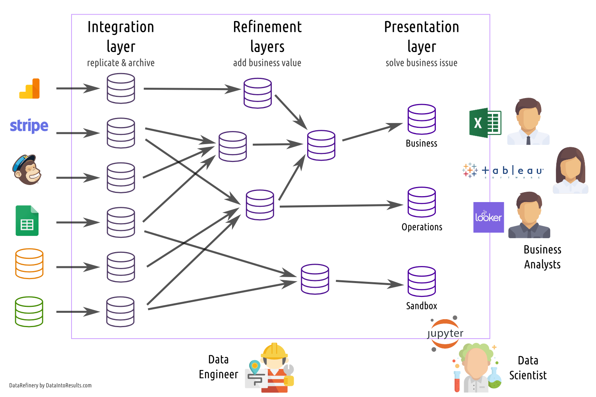

DataIntoResults Manifesto
=========================

With years of experiences in different companies, we came to a set of opinions on how Business Intelligence / Data Science should be run in a company. We dedicate ourselves to build the best tools to implements the following principles in [DataIntoResults](https://dataintoresults.com):

Module-based data warehouse
---------------------------

Our whole conception of a data warehouse is based around a three layers design that contains modules. Each module is a set of tables.

The first set of modules is the integration layer. The purpose of this layer is to replicate and archive data sources that are external from the data warehouse. It's the foundation where everything is built on top.

The second set of modules is the refining layers. This is where the magic happen, data from different modules are merged, consolidated, cleaned and were business rules are added. Your data gain more and more value through the layers.

The final set of modules is the presentation layer. This is where Business Analysts come to look for answers. The need of those module is therefore to be fast, simple to use and relevant.

You can think of the integration layer is more of [Bill Inmom](https://en.wikipedia.org/wiki/Bill_Inmon) philosophy while the presentation layer is directly inspired from [Ralph Kimball](https://en.wikipedia.org/wiki/Ralph_Kimball). We combine both approaches to take best of each.

Strongly ELT
------------

Historically, data management is done using an ETL tool. ETL stands for Extract-Transform-Load. Data is first extracted from where it resides, then transformed with cleaning/business rules before being inserted in the data warehouse. This approach allows a strong abstraction of the data warehouse.

We use an ELT approach, meaning that we first dump everything in the data warehouse mostly untouched (call it a data lake). Then we use the power of the data warehouse to transform the data.

Therefore, we leverage a lot the data warehouse and its particularities. We don't expect you to change the data warehouse technology often anyway.

Agility
-------

Most data warehouse project fails because they are too monolithic and start with an analysis that last for months (years?). We get it, the data warehouse is the version of the truth and it takes time to define the truth. 

Thing is, the world evolves quickly and we don't believe that there is one thing as the truth. Revenues is not the same for an accountant or a salesman for instance. The former will only believe accounting standard (and there is always non-GAAP metrics). The latter will only be interested in whatever is defined as revenue for his bonus. And, by the way, his bonus formula change for a better (i.e. more complex) formula with every new CEO.

With DataFactory, the idea is to start as quickly as possible in a sandbox. Getting real value the first day (purchasing process included) is not uncommon. 

The module system is also great to fence modules. If one module fails because of upstream changes, it doesn't impact the integrity of others modules (except those directly downstream).

Durability
----------

A data warehouse should be designed to last decades. Yet, many companies start again from scratch every now and then. The reason is simple; the data warehouse grew in size and complexity and is not manageable anymore. Some long deprecated business rules are still there. Metrics definitions are not conforming anymore.

Business is evolving quickly and it's difficult to keep a data warehouse clean within reasonable costs.

In the module-based data warehouse paradigm, every module has a lifespan. Some modules will last only weeks; some modules will be of lesser quality and that's fine. 

Cost-efficiency
---------------

Data management doesn't produce any value by itself. Having the bigger or more cutting edge data warehouse doesn't help much. You need insightful data and keep budget to act on it. You need most of your team to analyze and act on the data, not maintaining a data cathedral.

Cost-efficiency is on top of our mind. That's why we don't do real-time for instance. Because we know that it's insanely costly both in term of software and people to maintain it. 

All those principles are the foundation of [DataIntoResults](https://dataintoresults.com).

