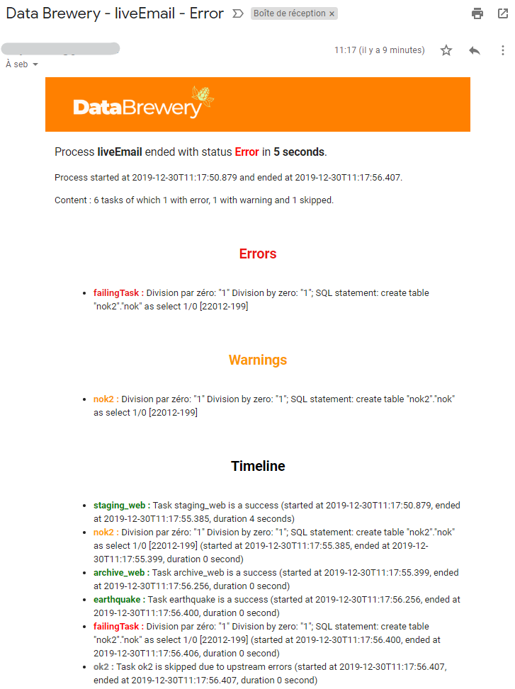

.. _notification_email:

Emails notifications
==========================

Emails notifications enable `Data Brewery <https://databrewery.co/>`_ to send an email at the
end of processes. The recipients can be set with the *email* attribute on the *process* element.
You can set multiple emails by separating them with comma.
You can define on which event a mail should be sent using the *emailWhen* attribute. It 
could contain : success, warning and/or error (you can select many event by separating them 
with comma). For more detail, see :ref:`the process page <spec_process>`.

.. code-block:: xml

  <process name="liveEmail"
    email="seb@databrewery.co,data@databrewery.co"
    emailWhen="error,warning">
    <!-- tasks here -->
  </process>

It is recommanded to set those parameters in the configuration files. Indeed, it's most likely
that you want notifications only for the production environment 
as the :ref:`example below <notification_email_example>` (see 
:ref:`environment configuration <environment_configuration>` for more details).

.. _notification_email_smtp:

Setting SMTP server connection
-------------------------------

In order to get emails working, you need to configure a SMTP server that will relay the mail.
Such configuration should be done in a configuration file (dw.conf by example). It is stored
under the *dw.mailer* configuration path. You can find more information on the 
`Play Mailer site <https://github.com/playframework/play-mailer>`_ (which is used internaly to send emails).

For instance, below is an exemple on how to use you AWS to send emails.

.. code-block:: json

  dw.mailer {
    // SMTP server depends on the datacenter
    host = "email-smtp.us-west-2.amazonaws.com" 
    port = 587
    tls = yes
    user = "your_smtp_username"
    password = "your_smtp_password"
  }

.. _notification_email_example:

Example
----------

As discussed at the begining of this page, it is better to specify the email notification 
configuration in a configuration file. Therefore, the XML specification will not 
show any sign of emails.

.. code-block:: xml

  <process name="liveEmail">
    <task module="staging_web"/>
    <task module="nok2" onError="warning"/>
    <task module="archive_web"/>
    <task module="earthquake"/>
    <task name="failingTask" module="nok2"/>
    <task module="ok2"/>
  </process>

But in the production configuration file we will add the necessary parts :

.. code-block:: json

  dw.process.liveEmail.email = "seb@databrewery.co,data@databrewery.co"
  dw.process.liveEmail.emailWhen = "error,warning"

You can see below an exemple of email received for the process *liveEmail* when it
ends with an error.

