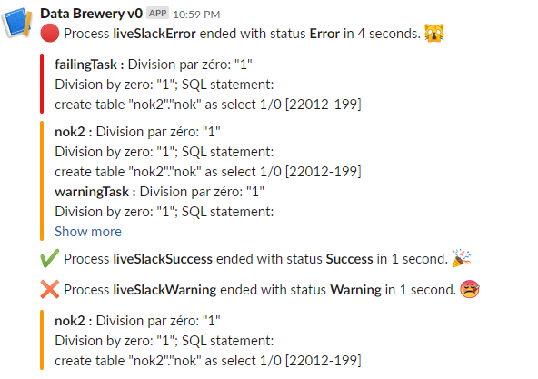

.. _notification_slack:

Slack webhook notifications
============================

The webhook Slack notification is an easy way to get notification on a Slack channel.
Each process can have a webhook and will post a notification on the associated channel 
when the process end.
As you can see in :ref:`the process section <spec_process>`, the *slackWebhook* attribute let you
specify the Slack webhook URL to use (:ref:`see below <notification_slack_webhook>`
on how to get the URL) and *slackWhen* let you specify the events when you wan to push a Slack notification 
(error, warning and/or success, separated by comma).

.. code-block:: xml

  <process name="liveSlackSuccess"
    slackWebhook = "https://hooks.slack.com/services/*******/*******/*******"
    slackWhen="error,warning">
    <!-- tasks here -->
  </process>

You can see below three examples of Slack notifications for processes failing, succeeding and warning.

.. _notification_slack_webhook:

Setup the webhook in Slack
---------------------------

In order to work, you need to get a webhook from Slack. A webhook is an URL in the form of
https://hooks.slack.com/services/aaaa/bbbb/cccccccc which will allow `Data Brewery <https://databrewery.co/>`_
to post a notification.

Getting such URL is a three-step process (steps 1-3 from `this Slack page <https://api.slack.com/messaging/webhooks>`_).

Step 1
#######

Create a Slack App using `this link <https://api.slack.com/apps/new>`_ (the popup 
can take some time to show). You need to 
give an app name (it could be anything, we recommand Data Brewery) and the workspace to
use.

Step 2
#########

After step 1, you will be redirected to the app page.
You need to select *Incoming Webhooks* in the feature and functionality section.

Step 3
#########

On the new page (see below), first, you need to toggle on the *Activate Incoming Webhooks*.
Then, you go on the end of the page and click on the *New Webhook to Workspace*.
A popup will allow you to select which Slack channel will be used (it should be created before).
It can be something like #etl or #etl-log.

Then you can click the Copy button to get the Webhook URL. You're done, congrats !

.. _notification_slack_example:

Example
---------

The following process will send a Slack notification through the *slackWebhook* when the process
end in failure (error) or with a warning (but don't send notification when the process succeed).

It is recommanded to set those parameters in the configuration files. Indeed, it's most likely
that you want notifications only for the production environment (see 
:ref:`environment configuration <environment_configuration>` for more details).

.. code-block:: xml

  <process name="liveSlackSuccess"
    slackWebhook = "https://hooks.slack.com/services/*******/*******/*******"
    slackWhen="error,warning">
    <task module="staging_web"/>
    <task module="archive_web"/>
    <task module="earthquake"/>
  </process>

