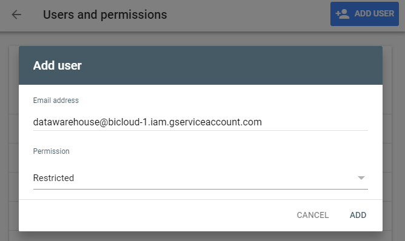

.. _store_google_search:

Google Search 
----------------------------

`Google Search Console <https://search.google.com/search-console>`_ allows you
to get insights on how your website perform in Google Search.

The datastore specification have the following parameters.

==================== ==========
Parameters           Details 
==================== ==========
name                 how you want this data store be refered as
type                 should be *googleSearch*
property             (optional) the default property for this datastore (e.g. https://dataintoresults.com)
serviceAccountEmail  Service account to use (see :ref:`Google Service Account <store_google_service_account>`)
keyFileLocation      The location of the p12 key (see :ref:`Google Service Account <store_google_service_account>`)
==================== ==========

Details are provided at table level, where every table of the datastore links to a selection 
against Google Search Console.

=============== ==========
Parameters      Details 
=============== ==========
name            how you want this table be refered as
property        the property to query (e.g. https://dataintoresults.com), will default to the store *property* if absent
startDate       Begining of the timeframe
endDate         End of the timeframe
=============== ==========

*startDate* and *endDate* can be given in absolute term 
with a YYYY-MM-DD pattern or using some special keys as XdaysAgo (where X is a number).

You need to allow the *serviceAccountEmail* to each property. This can be done in 
`Google Search Console <https://search.google.com/search-console>`_ under the *Parameters* section
then *Users and permissions*. From there, hit the *Add user* button and add the *serviceAccountEmail*.
You can safely set permissions to *Restricted*.

The columns you can query are the following. All need to be of type *text* except noted otherwise.

- **date** : date (in format YYYY-MM-DD)
- **clicks** : the number of clicks that led to the property (type should be int)
- **impressions** : the number of impression in the search engine (type should be int)
- **position** : the number fo clicks (type should be double)
- **query** : the search query that lead to an impression of the page
- **page** : full URL of the page
- **property** : the property given as parameter

=============== ==========
Parameters      Details 
=============== ==========
name            how you want this data store be refered as
type            use the correct type for each query given above
gsName          if the name doesn't correspond to a Google Search query, you need to specify it in gsName
=============== ==========

Important notes about Google Search
====================================

Recency
########

You shouldn't expect data to be up-to-date. According to Google : *Data is typically available after 2-3 days*.

Missing data
#############

When asking with a page or a query detail, Google may become inaccurate.

According to Google : 

*When you group by page and/or query, our system may drop some data in order 
to be able to calculate results in a reasonable time using a reasonable amount of computing resources.*

Our experience is that the page level is quite accurate for a small enough website (< 100 pages) but the 
query level is of low quality. The sum of impressions per query is around 10% of the total number of 
impression.

Example
========

You can see an example below. You will need a dedicated *serviceAccountEmail* and *keyFileLocation* as well as a 
*property* that you have access to.

.. code-block:: xml

  <datastore name="gs_dataintoresults"  type="googleSearch"
    serviceAccountEmail="test@bicloud.iam.gserviceaccount.com"
    keyFileLocation="key/test@bicloud.iam.gserviceaccount.com.p12">
    <table name="seo_pages" property="https://dataintoresults.com" startDate="30daysAgo" endDate="1daysAgo">
      <column name="date" type="text"/>
      <column name="page" type="text"/>
      <column name="impressions" type="int"/>
      <column name="clicks" type="int"/>
      <column name="avg_position" type="double" gsName="position"/>
    </table>
  </datastore>

