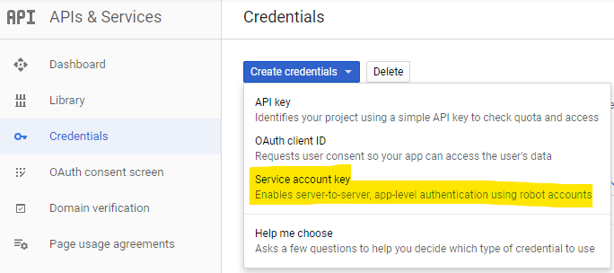
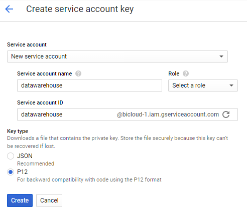
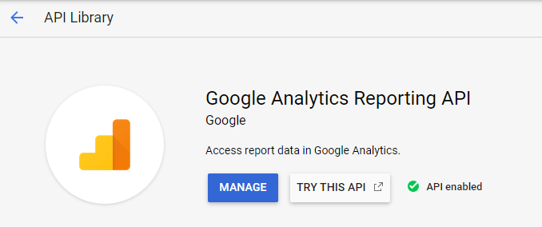

.. _store_google_service_account:

Google service account
-----------------------

In order to use integration like :ref:`Google Analytics <store_google_analytics>`
and :ref:`Google Sheet <store_google_sheet>`, you need a service account
that will be granted access to those services.

A service account is an account for applications that allows to manage credentials
without user involvement at each login.

You create and manage your Google API accounts using the 
`Google Console <https://console.developers.google.com/>`_. To create a credential
you need to go under section *Credentials*, hit the button *Create credentials*, then
click *Service account key* (see below).

On the creation form, you can set a service account name (like datawarehouse or etl).
The service account ID, will be the email you will have to allow
in the different Google services.

You don't have to set a role for the service (it doesn't need any project credential).
There will be a warning message that you can safely ignore.

Then, you need to select the key format, which in our case will be the P12 format.

When you click create, Google will provide you a key file that you will use
for later authentification. You can store it under the key directory of your project.

All Google datastores have an *serviceAccountEmail* attribute (the email defined above)
and a *keyFileLocation* attribute will is the location of the P12 file.

Finally, after creating the account, you need to active each API you want to use.
Go to the *Library* section of Google Console then type the API you want to activate,
like Google Analytics Reporting API, to enable Google Analytics request.

In the *manage* action, you can go to the credential part and check that the email
of your service account is there.

Here are the direct links for the important API you want to enable:

- `Google Analytics <https://console.developers.google.com/apis/api/analyticsreporting.googleapis.com>`_
- `Google Sheets <https://console.developers.google.com/apis/library/sheets.googleapis.com>`_
- `Google Sheets <https://console.developers.google.com/apis/library/sheets.googleapis.com>`_

