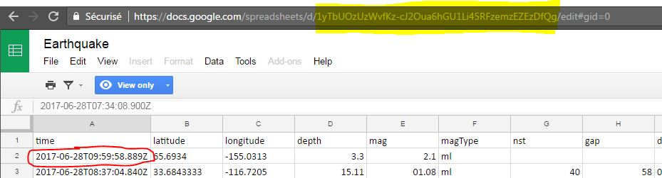

.. _store_google_sheet:

Google Sheets
----------------------------

`Google Sheets <https://www.google.fr/intl/fr/sheets/about>`_ is convenient to store user generated data like 
reference data or manual sales tracking. It can also be used as a dashboarding tool.

The datastore specification have the following parameters :

==================== ==========
Parameters           Details 
==================== ==========
name                 how you want this data store be refered as
type                 should be *googleSheets*
serviceAccountEmail  Service account to use (see :ref:`Google Service Account <store_google_service_account>`)
keyFileLocation      The location of the p12 key (see :ref:`Google Service Account <store_google_service_account>`)
==================== ==========

Details are mainly provided at table level, where every table of the datastore 
links to a selection inside a Google Sheet.

=============== ==========
Parameters      Details 
=============== ==========
name            how you want this table be refered as
spreadsheetId   the id of the Google Spreadsheet
sheet           the sheet name of a workbook (optionnal if it's the main sheet)
colStart        the column of the upper left cell of the selection (example "A" or "BF")
rowStart        the row of the upper left cell of the selection (exemple "1" or "3"), you should select the data part not the header
=============== ==========

The spreadsheetId for a Google Sheet can be found in the URL of the workbook like below 
(the spreadsheet can be consulted 
`here <https://docs.google.com/spreadsheets/d/1yTbUOzUzWvfKz-cJ2Oua6hGU1Li45RFzemzEZEzDfQg/edit#gid=0>`_). 
This workbook has only one sheet that is named "DATA". Therefore, using sheet="DATA" is optionnal.

In this example, the upper left cell of the selection (sourrounded in red) is A2. We don't use the header row (it is therefore not needed). The name, type and the number of columns are defined within the table specification with columns elements that have two attributes: the name of the column and its type.

.. code-block:: xml

   <datastore name="google_sheet" type="googleSheet">
     <table name="earthquake" spreadsheetId="1yTbUOzUzWvfKz-cJ2Oua6hGU1Li45RFzemzEZEzDfQg" sheet="DATA" colStart="A" rowStart="2">
       <column name="time" type="text"/>
       <column name="latitude" type="numeric"/>
       <column name="longitude" type="numeric"/>
       <column name="depth" type="numeric"/>
       <column name="mag" type="numeric"/>
       <column name="magType" type="text"/>
       <column name="nst" type="numeric"/>
       <column name="gap" type="numeric"/>
       <column name="dmin" type="numeric"/>
       <column name="rms" type="numeric"/>
       <column name="net" type="text"/>
       <column name="id" type="text"/>
       <column name="update" type="text"/>
       <column name="place" type="text"/>
       <column name="type" type="text"/>
       <column name="horizontalError" type="numeric"/>
       <column name="depthError" type="numeric"/>
       <column name="magError" type="numeric"/>
       <column name="magNst" type="numeric"/>
       <column name="status" type="text"/>
       <column name="locationSource" type="text"/>
       <column name="magSource" type="text"/>
    </table>

Writing details
===================

Currently, any data export to Google Sheet is limited to 10k rows. Those include empty rows that will be added after the 
last row to clear the destination. For instance, if your destination sheet has 1000 rows and you write 10 rows starting 
from row number 2, 989 rows will be written.

As well, you need to ensure that the destination sheet is big enough (in term of number of column and number of rows) 
to accept all the data.

