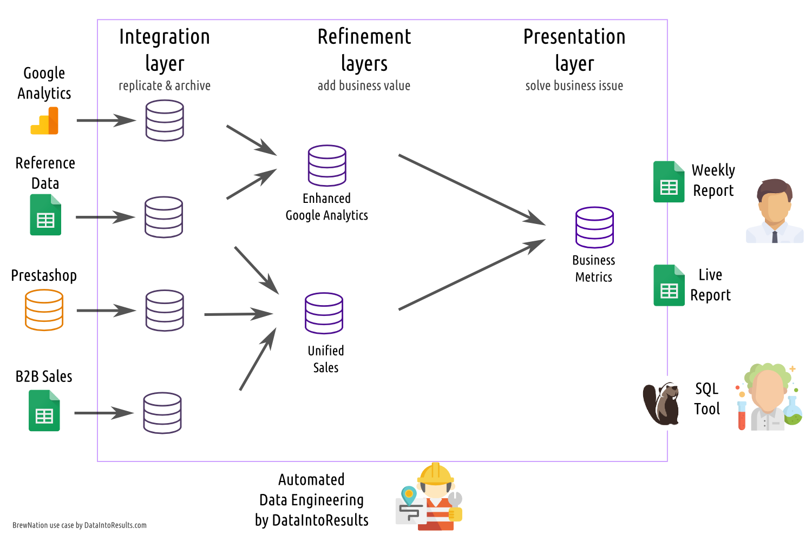
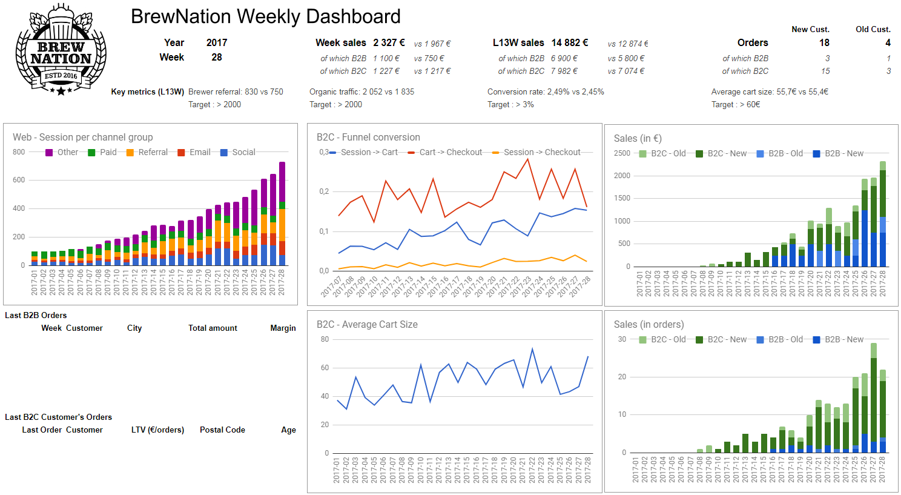
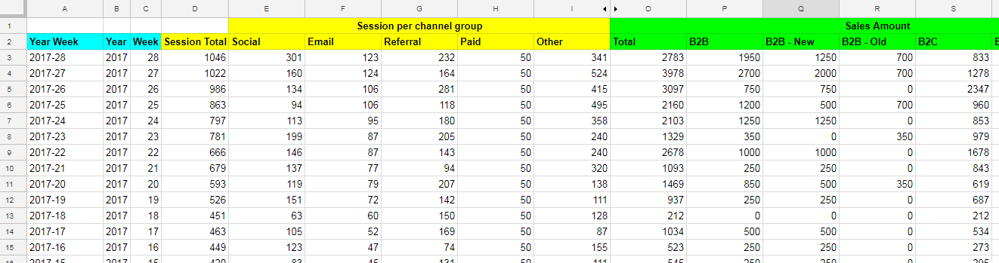

BrewNation Use Case
====================

Even for an early-stage startup, having good analytics is key to make good decisions and progress. `BrewNation <https://brewnation.fr/>`_  figured how to get fast and affordable analytics with the help of `DataIntoResults <https://dataintoresults.com/>`_ . Let’s see how it works.

BrewNation is a marketplace for craft beer in France. They connect small brewers that make excellent craft beer to their customers. It’s a B2C business (they send beers at your doorstep) as well as a B2B business (they sell to bars and retailers).

.. image:: images/brewnation-img.jpg
   :align: center

Even being young, they have disparate systems and no easy way to analyse data in a meaningful way. The acquisition and website navigation is monitored by Google Analytics, the B2C sale process is managed by Prestashop and the B2B sales process use a custom spreadsheet.

Moreover, in order to have meaningful analytics, some reference data as well as some business rules should be used. For instance, a referral from a blog review (PR effort) is not analysed the same way that a referral from a brewery (supplier acquisition effort).

The system is based on modules (you can learn more about it in our manisfesto). The global overview of the analytics architecture is therefore the following. Each data source is ingested in the analytical database, blended and refined to ease reporting and insight generation. Google Sheet reports are feed directly by the database.

The Google Sheet dashboard is always up-to-date with fresh data. A cohesive view of the operations is only one click away.

DataIntoResults provide the data plumbing tools and the analytics database (PostgreSQL) to orchestrate all the business intelligence process every night. Some dashboards are powered by Google Sheet to report the activity and allow simple digging into the data. For more advanced research, the analytics database is only one SQL query away and fully managed. Moreover, as the data is already refined, queries are easier to write and consistent with the dashboard.

The following is the main sheet of the weekly report (random data). Being a Google Sheet, it’s really easy to change the report if needed. For instance, the key metrics can change accordingly to the current focus of the team. No IT knowledge needed, it’s only a Google Sheet.

When making a Google Sheet reports (or an Excel one), it’s good practice to segregate the data sheets (where the base data reside) from the reporting sheets. Therefore, you can easily change what you report without changing the data plumbing. You will find a example of a data sheet below. From the third rpw it is automatically extracted from the database every day.

Having used the system for some months now, it is robust yet easy to evolve. It allows the company to be data-driven and be more focused on issues that can move the needle.

.. highlights::

	As a startup having reliable data is key to take decisions every day. Before using Dataintoresults we had multiple source of data which was time consuming for us. And as you know in a startup time is your most valuable asset! Thanks to Dataintoresults we have access to our data every morning in a very simple Google Spreadsheet. 
	— Luca Fancello, BrewNation CEO

Are you ready to get more insightful analytics? Please `contact us <mailto:contact@dataintoresults.com>`_ or :ref:`get started<getting_started>`. It’s free during the beta, so no reason to stay with low level analytics.